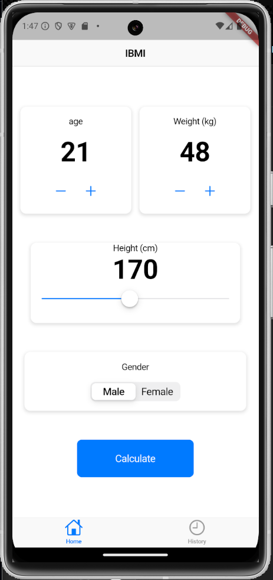
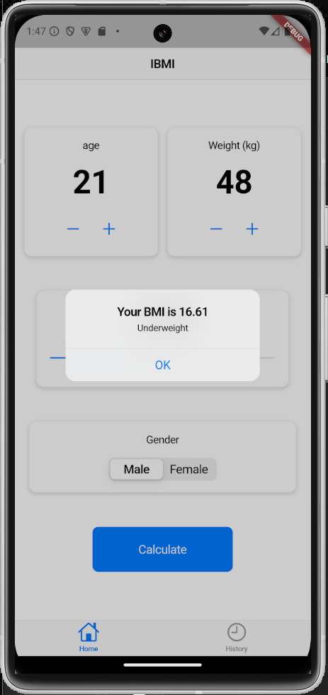
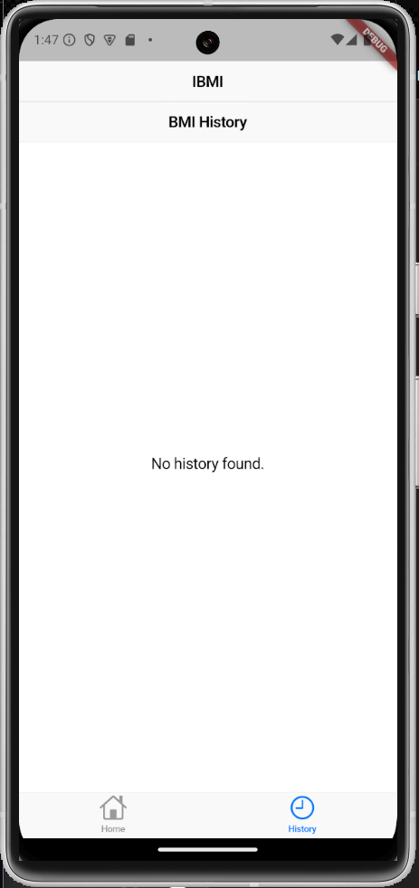
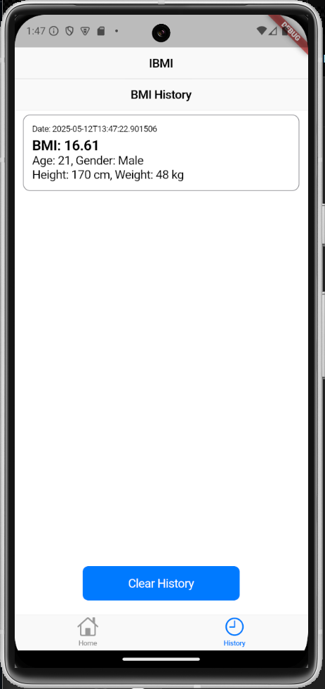

# IBMI - BMI Calculator App

IBMI adalah aplikasi kalkulator BMI (Body Mass Index) berbasis Flutter yang memungkinkan pengguna menghitung nilai BMI berdasarkan data **umur**, **berat badan**, **tinggi badan**, dan **jenis kelamin**, serta menyimpan riwayat perhitungan untuk referensi selanjutnya.

## 📱 Fitur Aplikasi

- Input **Umur**, **Berat**, **Tinggi**, dan **Gender**
- Perhitungan otomatis nilai BMI
- Menampilkan hasil perhitungan beserta kategori: 
  - Underweight
  - Normal weight
  - Overweight
  - Obesity
- Menyimpan riwayat perhitungan secara lokal menggunakan `shared_preferences`
- Halaman riwayat dengan opsi **Clear History**

## 📷 Tampilan Aplikasi

| Home Page | BMI Result | History Page Kosong | History Page Isi |
|-----------|------------|----------------------|------------------|
|  |  |  |  |

> Gambar-gambar di atas dapat kamu simpan di folder `documentation-app` untuk ditampilkan dengan baik di README.


## 🧪 Cara Menjalankan

1. Clone repository:

   ```bash
   [git clone https://github.com/DzikriNWP/IBMI-APP.git]
   cd IBMI-APP
   
Jalankan perintah berikut untuk menginstal dependensi:
flutter pub get
Jalankan aplikasi di emulator atau perangkat:
flutter run

🧰 Dependensi
- flutter/cupertino.dart
- shared_preferences - untuk menyimpan data lokal

Tambahkan ke pubspec.yaml jika belum:
dependencies:
  flutter:
    sdk: flutter
  shared_preferences: ^2.0.15
